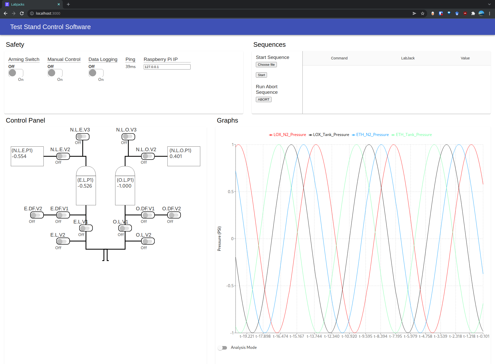

# ANU Rocketry Test Stand Control Panel



This project consists of two parts: a backend that runs on a Raspberry Pi written in Python, and a front end website client written using React.js. The two communicate over a point-to-point wifi connection.

Contents:
* [Setting up a computer for development](#development)
* [Setting up a Raspberry Pi](#setting-up-a-raspberry-pi-for-the-first-time) (this should not be necessary)
* [Setting up the Pi at the testing site](#setting-up-the-pi-at-the-testing-site)
* [Debugging with the Raspberry Pi](#how-to-debug)

# Development

Installation:

1. Install Node.js on the computer you're running the front-end on
1. Install Python >=3.10 so you can run a development server with fake data on the same computer
1. `git clone git@github.com:ANU-Rocketry/control-panel.git` and `cd control-panel`
1. In `control-panel/reactfront`, run `npm ci` to install dependencies for the React.js front end
1. In `control-panel/src`, run `pip install -r requirements.txt` to install server dependencies (this is so you can use your computer for a development server with fake data instead of a Raspberry Pi)

Then every time you want to run it:
1. In `reactfront` run `npm start` to launch the app on `http://localhost:3000/`
1. In `src` run `python server.py --dev` to start a development backend server generating fake data, and paste the IP address it prints out into the "R-Pi IP" field in the app

# Setting up a Raspberry Pi for the first time

You'll need a Raspberry Pi and your laptop, and some way of putting them on the same network. You can network with point-to-point ethernet or a hotspot + Linux compatible wifi dongle (don't need wifi dongle on newer Pi's). You cannot use ResNet as they block the ports we need.

1. Start up the Raspberry Pi and get internet access and a terminal
    * Option 1: If you have two ethernet cables and the router we use, plug the Pi into a LAN slot on the router, plug the external ethernet (eg ResNet) into the WAN slot, connect your laptop to the router's wifi, and SSH into `192.168.0.5`
    * Option 2: If you have a monitor, mouse, keyboard, and ethernet cable+port / wifi dongle / onboard wifi, you can just use those and open a terminal in the Raspbian desktop
    * Option 3: if you have a micro SD card reader and onboard wifi / a wifi dongle and a wifi network (hotspots are easy), you can configure it to connect to that wifi network by changing a config file on the SD card. See [this tutorial](https://www.raspberrypi-spy.co.uk/2017/04/manually-setting-up-pi-wifi-using-wpa_supplicant-conf/)
1. Open a terminal
1. Build the LabJack Exodrvier
    1. Go to your home folder (type `cd ~` in the terminal)
    1. `sudo apt-get update`, `sudo apt-get install git`, `sudo apt-get install screen`
    1. Install Python Pip if not already installed (`sudo apt install python3-pip`)
    1. Install the libusb headers with `sudo apt-get install libusb-1.0-0 libusb-1.0-0-dev` (note the dashes where you'd expect periods to be)
    1. Clone the Exodriver repository (`git clone https://github.com/labjack/exodriver`)
    1. Go into the repository (`cd exodriver`)
    1. Run installation script (`sudo ./install.sh`)
1. Install this repository
    1. Go to your home folder (`cd ~`)
    1. Clone this repository (`git clone https://github.com/ANU-Rocketry/control-panel`)
    1. Go into the repository (`cd control-panel`)
1. Install Python 3.10 from source (based off this: https://itheo.tech/installing-python-310-on-raspberry-pi)
    1. `screen -S rocketry_session`
    1. `wget -qO - https://raw.githubusercontent.com/tvdsluijs/sh-python-installer/main/python.sh | sudo bash -s 3.10.0` (this will take an hour for a new Pi and **3-4 hours** for an older one!)
        1. If you need to leave and come back without stopping the process, press Ctrl+A then Ctrl+D and close the SSH session. When you get back, run `screen -r` to resume it.
    1. `sudo python3.10 -m pip install --upgrade pip`
    1. `sudo python3.10 -m pip install -r requirements.txt`
        1. The sudo is VERY IMPORTANT. Otherwise the startup script will not be able to find the pip modules because they'll be locally installed otherwise
1. Configure startup script
    1. `sudo nano /etc/rc.local`
    1. Replace the contents with:
      ```sh
     #!/bin/sh -e
     sudo sh /home/pi/control-panel/startup.sh &
     exit 0
     ```
1. Set up static IP
    1. `sudo nano /etc/dhcpcd.conf` and paste this at the bottom:
      ```
      interface eth0
      static ip_address=192.168.0.5/24
      static routers=192.168.0.1
      static domain_name_servers=192.168.0.1
      ```
      Then it will have the IP `192.168.0.5`. This assumes the router has the IP `192.168.0.1`.
      
      If you need to use another ethernet connection you have two options: plug the outside network into the WAN port of the router you normally use, or connect directly and comment out these lines with `#` at the start of each line temporarily if you need to.
1. Set up `apcupsd` daemon to get UPS battery messages
    1. The Pi is plugged into a UPS to make it resistant to power cuts. This daemon lets us tell whether we're running on line power or UPS battery power so we can indicate this on the front-end. This only works if the Pi has a serial connection to the UPS using a USB-A to USB-B cable (labelled "PowerChute USB Port" on the UPS)
    1. `sudo apt-get install apcupsd`
    1. `sudo nano /etc/default/apcupsd` and change `no` to `yes`
    1. `sudo nano  /etc/apcupsd/apcupsd.conf` and set `UPSNAME rock-ups` (because it's an 8 char limit), `UPSCABLE usb`, `UPSTYPE usb`, `MINUTES 0` (avoid auto-shutdown), `DEVICE` (without the `/dev/tty*` part so it searches all serial connections)
    1. `sudo apcupsd restart` or `sudo /etc/init.d/apcupsd restart` or `sudo reboot` - whichever works
    1. Confirm `apcaccess status` comes up with a status other than `COMMLOST` (it should say `STATUS   : ONBATT` or `STATUS   : ONLINE`)
1. Run `ssh-copy-id pi@192.168.0.5` in a terminal on your laptop to copy your SSH key so you don't need a password when using `ssh pi@192.168.0.5`

# Setting up the Pi at the testing site

Whenever the pi is turned on from now on, the startup script will automatically host the frontend on `http://192.168.0.5:3000` and the backend on `http://192.168.0.5:8888`. The backend will fail to run if the Pi is powered before the LabJack USBs are plugged in. If this happens, you can SSH into it and `sudo reboot` when it should be ready

Ground site:
* Plug all power cables into the UPS except the camera system, these don't need to be power-cut resilient
* Plug the test stand LabJack USBs into the Pi (don't power the Pi before the LabJacks otherwise you'll need to `sudo reboot` it later!)
* Plug the Pi into the UPS using a USB-A to USB-B cable (labelled "PowerChute USB Port" on the UPS)
* Network everything with the switch and Ubiquiti P2P wifi card

Range/control site:
* Plug the other Ubiquity into the router
    * The Ubiquity needs power over ethernet. Use the black POE to power outlet cable to power it, and plug the non-POE second ethernet cable into one of the router's LAN slots
* Connect to the wifi on your laptop using the password on the box and navigate to `http://192.168.0.5:3000`. Set `R-Pi IP` to `192.168.0.5` in the browser.

# How to debug

To run the processes manually so you can see their output, SSH in and `pkill python3.10`. Then just use `python3.10 server.py` in the `src` folder to run a WebSockets Python server on port 8888. If you want to test without LabJacks connected, you can get a simulated LabJack with sine wave pressure data by using `python3.10 server.py --dev`.

The front end is written using Node and React, but the version in the `build` folder is static and already built and just needs to be locally hosted. `python http.server` is one way of doing this, but there are others. When pushing front-end changes, make sure to run `npm run build` to make sure the static already built version is kept up to date. You'll also need to pull/`scp` the new version on the Pi.

For developing and debugging the front-end, you do need Node.js installed. To develop the front-end, you need nodejs. Run `npm ci` in the `reactfront` folder to install dependencies. Run `npm run build` to generate the `reactfront/build` folder which is what the Pi hosts on `http:192.168.0.5:3000`. To go into a local interactive debugging mode with hot reloading, run `npm start` and set `R-Pi IP` to `192.168.0.5` in the browser.

Whenever you make changes on your laptop, you need to copy them over to the Pi via `scp` (if you're on a test site on the same network without internet) or push to git and pull on the Pi (if the Pi has internet access).

To test the server locally, run `python3 server.py --dev` on your laptop. In the frontend, you'll need to change `R-Pi IP` to your local IP address. You should see simulated sine wave pressure data.

If you have any problems, just file a GitHub Issue, contact us on Microsoft Teams or email our student emails.

## Pushing new builds on the fly

The startup script on the Pi runs a static server with `reactfront/build`, so you can update these files with `scp` and then reload the page to update the front end on any device:

```sh
# delete old build (on the raspberry pi!)
ssh pi@192.168.0.5
cd ~/control-panel/reactfront
rm -r build
logout

# scp over new build (on your machine!)
cd reactfront
npm run build
scp -r build pi@192.168.0.5:/home/pi/control-panel/reactfront
# Reload http://192.168.0.5:3000 in your browser
```

# Data Schema

Data is transferred between the server and client over websockets.

## Command

A command consists of a `header` and a `parameter`. Valid commands can be seen below:


| header | parameter |
| - | - |
| OPEN | {"name":labjack_name, "pin":pin} |
| CLOSE | {"name":labjack_name, "pin":pin} |
| SLEEP | {"milliseconds": time in ms} |
| BEGINSEQUENCE | (parameter is unimportant) |
| ABORTSEQUENCE | (parameter is unimportant) |
| ARMINGSWITCH | on_bool |
| MANUALSWITCH | on_bool |
| DATALOG | on_bool |
| SETSEQUENCE | [command1, command2, ...] |

A sequence is a list of multiple commands. These commands can only consist of `OPEN`, `CLOSE` and `SLEEP` commands.
