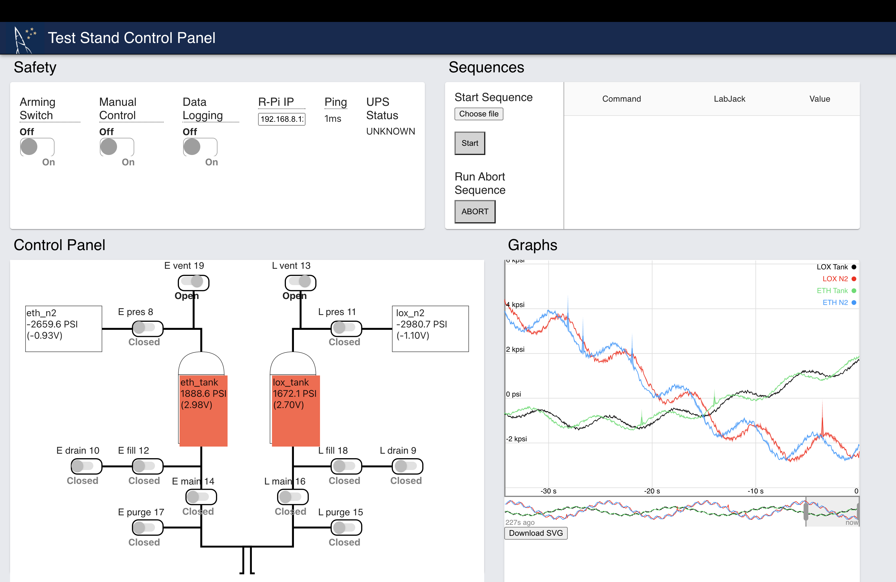

# LJSoftware

Full stack suite to allow custom control of LabJacks, over TCP for rocket testing



This project consists of two parts: a backend that runs on a Raspberry Pi written in Python, and a front end website client written using Node.js and React.js. The two communicate over a point-to-point wifi connection.

# How To Use

You'll need a Raspberry Pi and your laptop, and some way of putting them on the same network. You can network with point-to-point ethernet or a hotspot + Linux compatible wifi dongle (don't need wifi dongle on newer Pi's). You cannot use ResNet as they block the ports we need.

Setting up the Raspberry Pi:
1. Open a terminal
1. Build the LabJack Exodrvier
    1. Go to your home folder (type `cd ~` in the terminal)
    1. Install Python Pip if not already installed (`sudo apt install python3-pip`)
    1. Install the libusb headers with `sudo apt-get install libusb-1.0-0 libusb-1.0-0-dev` (note the dashes where you'd expect periods to be)
    1. Clone the Exodriver repository (`git clone https://github.com/labjack/exodriver`)
    1. Go into the repository (`cd exodriver`)
    1. Run installation script (`sudo ./install.sh`)
1. Install this repository
    1. Go to your home folder (`cd ~`)
    1. Clone this repository (`git clone https://github.com/pstefa1707/LJSoftware`)
    1. Go into the repository (`cd LJSoftware`)
    1. Run `sudo pip install -r requirements.txt`
      1. The sudo is VERY IMPORTANT. Otherwise the startup script will not be able to find the pip modules because they'll be locally installed otherwise
1. Configure startup script
    1. `sudo nano /etc/rc.local`
    1. Replace the contents with:
      ```sh
     #!/bin/sh -e
     sudo sh /home/pi/LJSoftware/startup.sh &
     exit 0
     ```
1. Set up Ubiquity point-to-point wifi
    1. `sudo nano /etc/dhcpcd.conf` and paste this at the bottom:
      ```
      interface eth0
      static ip_address=192.168.1.5/24
      static routers=192.168.1.2
      static domain_name_servers=192.168.1.2
      ```
      Then it will have the IP `192.168.1.5`. This assumes the gateway (the router-y thing you plug the Pi into via ethernet) has the IP `192.168.1.2` and has no DCHP (so you need to manually set the IP). If you need to use another ethernet connection you'll have to comment out these lines with `#` at the start of each line temporarily.

How to run the backend on the Pi
1. If you used the Ubiquity and startup script steps, plug the LabJacks via USB to the Pi, connect one end of the Ubiquity to the ethernet port, then power the Pi. Configure your laptop to use a manual IP for ethernet (eg 192.168.1.4) plugged into the other Ubiquity and then open the front-end as above. If you aren't using this setup follow the remaining instructions
1. Connect the Pi to the same network as your laptop (cannot be ResNet) via point-to-point wifi, ethernet or a mobile hotspot
    * If you have a USB wifi dongle with Linux support, you can connect manually to a fixed wifi network with [this tutorial](https://www.raspberrypi-spy.co.uk/2017/04/manually-setting-up-pi-wifi-using-wpa_supplicant-conf/). You'll just need a laptop with an SD card reader OR a keyboard and monitor and HDMI cable to edit the files on the Pi
    * If you have an ethernet cable you just need your laptop to have an ethernet port
    * If you have in-built wifi on your Pi, you'll just need a keyboard, mouse and monitor to set it up
1. Connect the LabJacks via USB to the Pi
1. `cd ~/LJSoftware/src`
1. Run `ip route get 8.8.8.8 | awk '{print $(NF-2); exit}'` to get the Raspberry Pi's local IP address
1. Edit `server.py` to change the IP address at the end to be the local IP of the Pi (if you're using Ubiquity as above this is already done)
1. Run `python server.py` to start the backend server (on port 8888 if you're interested)

How to start the front-end on your laptop
1. Clone the LJSoftware repository as above (you'll need Git installed on your laptop for this, if you don't you can download it as a zip which is also fine)
1. Open a terminal, run `cd reactfront/build` and then `python -m http.server` and open the link it comes up with
1. Enter the IP address from the Raspberry Pi into the website
1. You should see data coming in, and if you enable the manual and arming switches you should be able to control valves. If it stops showing data it's not connected.

If you have any problems, just file a GitHub Issue, contact us on Microsoft Teams or email our student emails.

Note: the front end is written using Node and React, but the version in the `build` folder is static and already built and just needs to be locally hosted. `python http.server` is one way of doing this, but there are others. For developing and debugging the front-end, you do need Node.js installed (see below).

# Development

To run the dev build of the front-end, you will need to install Node.js on the computer you're running the front-end on. Then download this repository on that computer, go into the `reactfront` folder in a terminal / command prompt, run `npm install` and then `npm start`. After a short wait this will open a browser tab with the front end in it. When you're done make sure to `npm run build` so the `reactfront/build` folder is updated.

# Data Schema

Data is transferred between the server and client over websockets.

## JSON

The data in a valid request (from client to server) is JSON following the schema:

```json
{
"command":
  {
    "header": <Header String>,
    "data": <Command Parameter>
  },
"time": <Time in milliseconds since EPOC>
}
```
The data in a state 'emit' from the server is JSON following the schema:

```json
{
"type": "STATE",
"data":
  {
    "arming_switch" : Bool,
    "manual_switch" : Bool,
    "current_sequence" : null or list of commands,
    "sequence_running": Bool,
    "lox":
      {
        "digital":{
          Pin(int):Bool
        },
        "analog":{
          Pin(int):Float
        }
      },
     "eth":
      {
        "digital":{
          Pin(int):Bool
        },
        "analog":{
          Pin(int):Float
        }
      }
  },
"time": <Time in milliseconds since EPOC>
}
```
The data in an error response follows the following schema:

```json
{
"type": "ERROR",
"data": Error message,
"time": <Time in milliseconds since EPOC>
}
```

## Command

A command consists of a `header` and a `parameter`. Valid commands can be seen below:


| header | parameter |
| - | - |
| OPEN | {"name":labjack_name, "pin":pin} |
| CLOSE | {"name":labjack_name, "pin":pin} |
| SLEEP | {"milliseconds": time in ms} |
| GETDIGITALSTATES | {"name":labjack_name, "pins":[pin1, pin2, ...]} |
| GETANALOGSTATES | {"name":labjack_name, "pins":[pin1, pin2, ...]}|
| BEGINSEQUENCE | (parameter is unimportant) |
| ABORTSEQUENCE | (parameter is unimportant) |
| ARMINGSWITCH | on_bool |
| MANUALSWITCH | on_bool |
| DATALOG | on_bool |
| SETSEQUENCE | [command1, command2, ...] |

A sequence is a list of multiple commands. These commands can only consist of `OPEN`, `CLOSE` and `SLEEP` commands.

These commands can be represented and authorised by the `LJCommands.py/Command` object. They can also be represented as strings in the JSON TCP requests.

# Error Handling

Errors are categorised according to their importance by a system of numbering:
  - 1000-level digits are overall importance
  - 100-level digits partition errors according to subtype

### Command Errors

| error code | description |
| - | - |
| 2001 | Command header is not valid |
| 2101 | Csv provided and no parameter without SETSEQUENCE header |
| 2102 | Invalid first column command for sequence |
| 2103 | Invalid second column command for sequence |
| 2104 | With OPEN or CLOSE, PIN is not within allowed channel numbers |
| 2105 | Sleep duration is not an integer |
| 2201 | For single OPEN or CLOSE command, param dictionary is malformed |
| 2202 | Digital or analogue state request is malformed |
| 2203 | Pin is not an allowed numnber in digital or analog state read |
| 2204 | SLEEP is not of integer type |
| 2205 | ARMINGSWITCH or MANUALSWITCH is not of bool type |
| 2206 | Begin/end sequence takes no parameters |
| 2207 | Invalid sequence (not a list of JSON strings, dictionaries or Command objects) |

# Project Overview

The `LabJack.py` file contains a simple library used to communicate with the LabJacks themselves. The `LabJackFake.py` file provides a fake interface such that we can build the rest of the software without the LabJacks.


The `LJCommands.py` file contains the `Command` and `CommandString` objects, which define hollistic commands and headers respectively. The `Command` object ensures correctness of commands. This object throws errors.


The `LJClient.py` will contain an object that interfaces with the `LJSocket` over TCP and contains an interface similar to that in `LabJack.py` to communicate with the LabJacks, abstracting all TCP yucky stuff.


The `LJSocket.py` file contains the `LJSocket` object which hosts an asynchronous TCP web server that serves clients, parses JSON data, commands, and all backend stuff.
